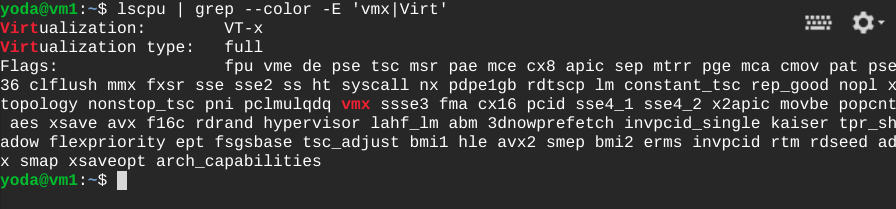
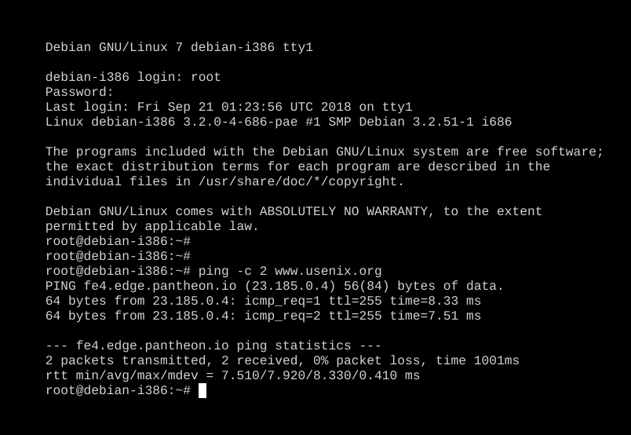

This walkthrough is based on this [sample tutorial](https://github.com/GoogleCloudPlatform/community/tree/master/tutorials/managing-gcp-projects-with-terraform) with my own modifications.

Assuming that the `${USER}` resolves to `auser`.

* Customize `variables.tf` for your environment.
* Before you continue, please move `vm.tf` to be outside of the directory that contains all the `*.tf` files.
And you might want to edit `project.tf` and change the project name to one of your own liking. It is
currently set to `tf-nestedvirt3`.

```bash
$ source ./activate

$ echo $TF_ADMIN
auser-admin1

$ gcloud projects create ${TF_ADMIN} \
>   --organization ${TF_VAR_org_id} \
>   --set-as-default
Create in progress for [https://cloudresourcemanager.googleapis.com/v1/projects/auser-admin1].
Waiting for [operations/cp.8118273614719203779] to finish...done.
Updated property [core/project] to [auser-admin1].

$ gcloud projects list
PROJECT_ID          NAME              PROJECT_NUMBER
auser-admin1        auser-admin1      358740722968

$ gcloud beta billing accounts list
ACCOUNT_ID            NAME                       OPEN  MASTER_ACCOUNT_ID
000000-FFFFFF-EEEEEE  Mon compte de facturation  True
```

Next we create an parent project for use by terraform.

```bash
$ gcloud iam service-accounts create terraform \
>   --display-name "Terraform admin account"
Created service account [terraform].

$ gcloud iam service-accounts list
NAME                     EMAIL
Terraform admin account  terraform@auser-admin1.iam.gserviceaccount.com

$ gcloud iam service-accounts keys create ${TF_CREDS} \
>   --iam-account terraform@${TF_ADMIN}.iam.gserviceaccount.com
created key [d1f22ef4c4086bc4c12a2bd13ab6e2087a7f6025] of type [json] as 
[/home/auser/.gcloud/auser-terraform-admin.json] for [terraform@auser-admin1.iam.gserviceaccount.com]

$ gcloud projects get-iam-policy ${TF_ADMIN}
bindings:
- members:
  - user:auser@example.com
  role: roles/owner
etag: BwV2PD5MxnU=
version: 1

$ gcloud projects add-iam-policy-binding ${TF_ADMIN} \
>   --member serviceAccount:terraform@${TF_ADMIN}.iam.gserviceaccount.com \
>   --role roles/viewer

$ gcloud projects add-iam-policy-binding ${TF_ADMIN} \
>   --member serviceAccount:terraform@${TF_ADMIN}.iam.gserviceaccount.com \
>   --role roles/storage.admin

$ gcloud projects get-iam-policy ${TF_ADMIN}
bindings:
- members:
  - user:auser@example.com
  role: roles/owner
- members:
  - serviceAccount:terraform@auser-admin1.iam.gserviceaccount.com
  role: roles/storage.admin
- members:
  - serviceAccount:terraform@auser-admin1.iam.gserviceaccount.com
  role: roles/viewer
etag: BwV2PJdEQ84=
version: 1


$ gcloud services enable cloudresourcemanager.googleapis.com
Operation "operations/acf.e85faf36-fed9-40ca-940a-83fe6ec8d93a" finished successfully.

$ gcloud services enable cloudbilling.googleapis.com
Operation "operations/acf.89ff7ae6-d421-45b3-a72f-28223c7cea01" finished successfully.

$ gcloud services enable iam.googleapis.com
Operation "operations/acf.a95febef-03cd-4736-b1b7-028402c3ae16" finished successfully.

$ gcloud services enable compute.googleapis.com
# Wait 4-5 minutes to complete
Operation "operations/acf.2be58b51-1766-483e-9baf-55cdfa8712d6" finished successfully.


$ gcloud iam service-accounts list --verbosity debug
DEBUG: Running [gcloud.iam.service-accounts.list] with arguments: [--verbosity: "debug"]
INFO: Display format: "table(displayName:label=NAME, email)"
NAME                                    EMAIL
Compute Engine default service account  358740722968-compute@developer.gserviceaccount.com
Terraform admin account                 terraform@auser-admin1.iam.gserviceaccount.com
DEBUG: SDK update checks are disabled.

$ gcloud organizations add-iam-policy-binding ${TF_VAR_org_id} \
  --member serviceAccount:terraform@${TF_ADMIN}.iam.gserviceaccount.com \
  --role roles/resourcemanager.projectCreator

$ gcloud organizations add-iam-policy-binding ${TF_VAR_org_id} \
  --member serviceAccount:terraform@${TF_ADMIN}.iam.gserviceaccount.com \
  --role roles/billing.user
bindings:
- members:
  - domain:example.com
  role: roles/billing.creator
- members:
  - serviceAccount:terraform@auser-admin1.iam.gserviceaccount.com
  role: roles/billing.user
- members:
  - domain:example.com
  - serviceAccount:terraform@auser-admin1.iam.gserviceaccount.com
  role: roles/resourcemanager.projectCreator
etag: BwV2PPfw94Q=  

$ gsutil mb -p ${TF_ADMIN} gs://${TF_ADMIN}
Creating gs://auser-admin1/...

$ gsutil ls
gs://auser-admin1/

$ gsutil versioning set on gs://${TF_ADMIN}
Enabling versioning for gs://auser-admin1/...

$ echo $GOOGLE_APPLICATION_CREDENTIALS
/home/auser/.gcloud/auser-admin1.json

$ echo $TF_ADMIN
auser-admin1
```

Initialize the backend in terraform.

```bash
$ TF_LOG=yes terraform init
2018/09/19 10:51:23 [WARN] Invalid log level: "yes". Defaulting to level: TRACE. Valid levels are: [TRACE DEBUG INFO WARN ERROR]
2018/09/19 10:51:23 [INFO] Terraform version: 0.11.8  7a5c1d221ac209bbac66947c369815cd9ca70ed5
2018/09/19 10:51:23 [INFO] Go runtime version: go1.10.1
...
2018/09/19 10:51:26 [DEBUG] found valid plugin: "google", "1.18.0", "/home/auser/tf/basic/.terraform/plugins/linux_amd64/terraform-provider-google_v1.18.0_x4"
2018/09/19 10:51:26 [DEBUG] checking for provider in ".terraform/plugins/linux_amd64"
2018/09/19 10:51:26 [DEBUG] found provider "terraform-provider-google_v1.18.0_x4"
..
Terraform has been successfully initialized!
```


And once that is ready, run the following:

```bash
$ terraform apply
```

At this point, you have a new project. You need to switch to it.

```bash
$ gcloud config set project tf-nestedvirt3
```

Next we create a new image with the virtualization license activated.

```bash
(tf-nestedvirt3)$ export SOURCE_PROJECT=debian-cloud
(tf-nestedvirt3)$ export SOURCE_FAMILY=debian-9

(tf-nestedvirt3)$ gcloud compute images create nested-v20180919 --family debian-9 
   --source-image-project $SOURCE_PROJECT  
   --source-image-family $SOURCE_FAMILY 
   --licenses=https://www.googleapis.com/compute/v1/projects/vm-options/global/licenses/enable-vmx
Created [https://www.googleapis.com/compute/v1/projects/tf-nestedvirt3/global/images/nested-v20180919].
NAME              PROJECT         FAMILY    DEPRECATED  STATUS
nested-v20180919  tf-nestedvirt3  debian-9              READY

(tf-nestedvirt3)$ gcloud compute images list --format='table(name,licenses)' --filter="family:debian-9"
NAME                        LICENSES
debian-9-stretch-v20180911  [u'https://www.googleapis.com/compute/v1/projects/debian-cloud/global/licenses/debian-9-stretch']
nested-v20180919            [u'https://www.googleapis.com/compute/v1/projects/vm-options/global/licenses/enable-vmx', 
                             u'https://www.googleapis.com/compute/v1/projects/debian-cloud/global/licenses/debian-9-stretch']
```

Now move back `vm.tf` to your terraform directory.

```bash
$ terraform apply

google_compute_instance.vm: Still creating... (10s elapsed)
google_compute_instance.vm: Creation complete after 15s (ID: vm1)

Apply complete! Resources: 1 added, 0 changed, 0 destroyed.

Outputs:

ip = xx.xxxx.yyy.zz
project_id = tf-nestedvirt3
```

Verify that the L1 VM is configured with VT-x.



The second thing is to allow the nested VM (L2 VM) to ping. This step is required as we are using [QEMU user networking](https://wiki.qemu.org/Documentation/Networking)

```bash
vm1$ sudo bash -c "echo '0 128' > /proc/sys/net/ipv4/ping_group_range"
```

Now we are ready to fire up our nested VM. 

```bash
vm1$ wget https://people.debian.org/~aurel32/qemu/i386/debian_wheezy_i386_standard.qcow2

vm1$ sudo qemu-system-i386 -enable-kvm -hda debian_wheezy_i386_standard.qcow2 -net nic -net user -curses
```

When the nested VM's login prompt appears, log in with user `root` & password `root`.


